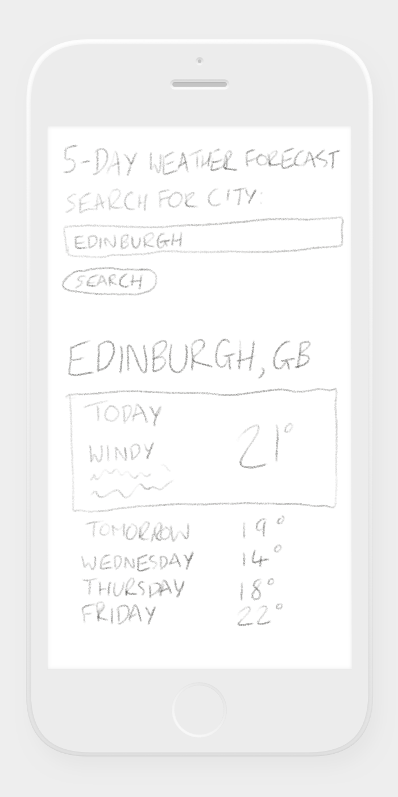
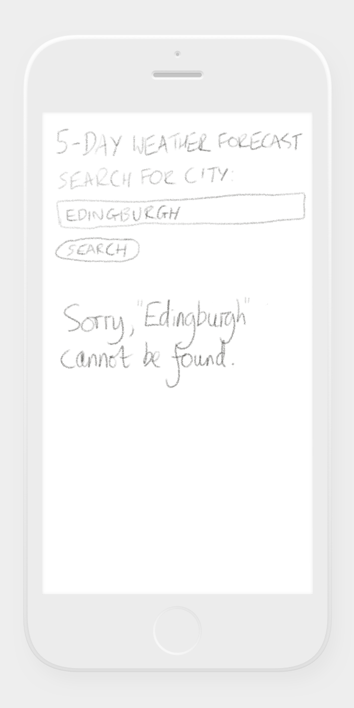

# weather-forecast-demo-app

## Live demo

A live demo of this app is available to view at https://weather-forecast-demo-app.now.sh (hosted using the [now](https://zeit.co/now) hosting service).

<a href="https://weather-forecast-demo-app.now.sh"></a>

## How to use the app

### To see weather for a city:

1) Type a city name such as "Edinburgh" into the search box
2) Click on the Search button

### To see an error:

1) Type a long nonsense string such as "hhdsa7312123" into the search box
2) Click on the Search button

## How to run, test and build the app

This app was built and tested with the latest version of Node at the time it was written - 12.13.0 - and has not been tested on older versions. I have added an .npmrc file to the root of the project directory, so if you have nvm installed you can switch to version 12.13.0 by running "nvm use" at the command line.

### How to run the dev build (includes hot reloading)

```
npm install
```

### How to run the dev build (includes hot reloading)
```
npm run dev
```

### How to run production build
```
npm run build
npm start
```

### How to run JavaScript linting
```
npm run lint
```
Note: you may see "can't resolve reference" messages in the console when running linting, this is a known [bug in eslint-plugin-react](https://github.com/airbnb/javascript/issues/1488) that can be ignored.

### How to run unit tests
```
npm test
```

### How to deploy

If you have the [now](https://zeit.co/now) application installed locally:

```
now
```

## Boilerplate used

For personal projects I often use [create-react-app](https://github.com/facebookincubator/create-react-app), but since I thought it would be useful to see my own project configuration (e.g. for Babel, Webpack, ESLint) I used a boilerplate React project configuration that I created recently named [Clean React Boilerplate](https://github.com/robhowell/clean-react-boilerplate) as the foundation of this implementation. Everything within the /src/ folder was created from scratch for this project.

## Design

After taking a quick look at the API documentation, I spent 5 minutes drawing the following rough wireframes:

 

## Changes I would make if I had more time

### Security

- Before going to production there would need to be a thorough security review, looking for vulnerabilities in both the source code for the project and in all module dependencies.

### Testing and linting

- Although most of the core components are covered by unit tests, unit test coverage should be increased significantly, ideally using githooks to ensure that a code coverage threshold is met before code is committed.
- End to end Cucumber tests should be created, normally by a test automation engineer, testing against high-level acceptance criteria (supplied by business analysts) to ensure that the business requirements have been satisfied.
- Visual regression tests: these tests are extremely useful for preventing style regressions when developing web projects, which makes styling changes in a CD or CI project far less risky than they would otherwise be. Since they are very time consuming, often they will be run as part of a nightly build rather than executed every time a developer pushes a new commit to a repo.
- JavaScript linting has been included using ESLint, but I would also add linting for the stylesheets using a tool such as Stylelint.

### Data validation

- I have created a basic validation function to check the server response (src/networking/isServerJsonValid.js) but in a real-world application I would implement more thorough validation.

### CI pipeline

- In a serious project, I would expect a CI pipeline to be created using a tool such as Jenkins or Travis CI. 

### Perceived performance

- Since this app is written using React, it would be relatively straightforward to implement isomorphic rendering, which would allow the page to pre-render on the server. This would improve the loading time of the app.

### Server performance

- Caching should be used to minimise unnecessary calls to the server for repeated searches.

### Compatibility

- This app has only been tested in Google Chrome. In a real-world app, it should be tested on a wider range of web browsers before deployment.

### Usability and design

- The API provides IDs for icons that represent each weather state, which I would use to show images for each weather state.
- Rather than show the weather for every 3 hours as provided by the API, by default I would show an average temperature for the day with a limited subset of key data, e.g. "Rain/Wind".

### Features

- The current and next day day should show as "Today" and "Tomorrow" instead of using the name of the day.
- If a basic subset of the weather data was shown for each day (as per original wireframe), then I would like the user to be able to click on the day to show a more comprehensive listing of the weather for the respective day. This could be implemented using an "accordion" design.
- The API documentation explains that searching by city name is an imprecise approach, and that it is preferable to use the JSON-formatted city list to find a specific city before submitting a weather request by city ID. I would create a server endpoint in Node that could search through the city list, then update the frontend to use a search-as-you-type field that shows the suggested cities in a list below as the user types. Currently, most nonsense searches still result in a city being found - to produce an error you need to enter a longer nonsense search such as "hhdsa7312123" as per error example.

### Accessibility

- The app should be made keyboard accessibile, e.g. you should be able to press enter to submit the city.
- Basic accessibility markup of components are checked with the linting rules, but the app should be properly tested using an accessibility tool such as aXe to check that the markup complies with accessibility standards, e.g. including correct ARIA tags.

### Hosting

- For a real-world enterprise deployment, I would expect to use a service such as AWS (Amazon Web Services) to host the project. If it stayed as a client-side app it could be deployed fairly simply using S3, but to support isomorphic rendering a Node server would need to be used instead.

### Technical debt

- Within the WeatherForNext5Days component, I implemented a function named getWeatherDataDayArray() that takes an array of weather for every three hours and outputs an array of days that contains the weather info for each day. As an initial implementation I used a reduce function to create an object, then mapped this into an ordered array. Given more time, I would look at alternative ways to implement this functionality - it could be done more efficiently, but could also be made more readable. Given that this code is run on the client side with a relatively small set of data, in this case I think readability is more important than performance.
- More semantically accurate HTML tags could be used, e.g. the list of weather within each day could be built as an unordered list.
- I initially built this app with a mobile-first design, but in a real-world app I would implement a responsive-design layout that makes better use of the space available in larger screen resolutions.
- The Webpack configuration for this project is deliberately as simple as possible. In a real-world app there should be more work completed to strip unnecessary code (e.g. PropTypes) and to minify the JavaScript in the production build.
